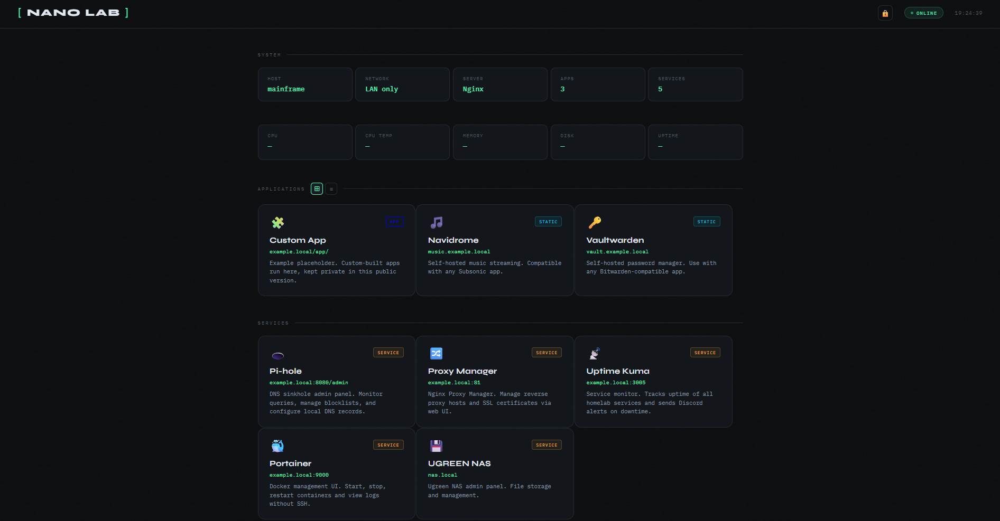

# Frontend

The landing page for the lab. It's a single dashboard that links out to every app and service, shows basic system info, and acts as the front door to everything running here.

## A note on the example

The `index.html` in this repo is `index.html.example`, a sanitized version. The real dashboard lists the custom apps and internal hostnames, so the public version swaps those for a placeholder card and `example.local` addresses. To use it, copy `index.html.example` to `index.html` and fill in your own apps and hostnames.
